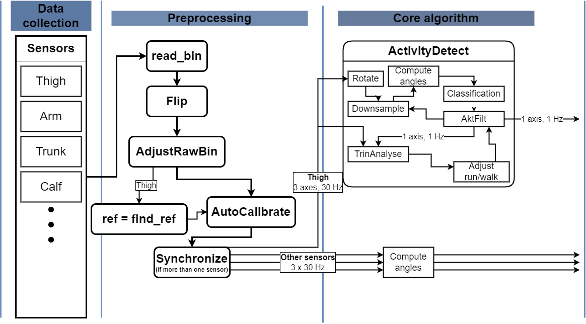

<h1 align="center">

</h1> 

# Table of Contents
- [Table of Contents](#table-of-contents)
- [What is Motus?](#what-is-motus)
- [How Motus works](#how-motus-works)
  - [Activity detection](#activity-detection)
  - [Attaching sensors?](#attaching-sensors)
  - [Getting data from cloud?](#getting-data-from-cloud)
- [Versions](#versions)
- [Installation](#installation)
- [Usage](#usage)
- [Get in touch](#get-in-touch)
- [Contributions](#contributions)

# What is Motus?
Motus is a activity detection system developed by the National Research Centre for the Working Environment (NFA). With Motus you can

- Measure physical activities with a thigh sensor (accelerometer)
- Measure more activities with more sensors
- Some more cool stuff
- Be in contact with Rasmus, aka MR. Coolio

If you want to know more about NFA or Motus you can take a look here  

[Website](https://nfa.dk "NFA's homepage")  
[Source code](https://github.com/motus-nfa/Motus "GitHub repository")

# How Motus works
## Activity detection
<h1 align="center">

</h1> 

- Core Acti4 developed by Jørgen Skotte for Det Nationale Forskningscenter for Arbejdsmiljø.
  - Input three signals
  - Decision tree
  - Output activity types [Some image on movement types]
- Preprocessing functions
- Postprocessing functions
    - Report for participants [insert examples in these bullets]
    - Report for work employer
    - Report for work environment professionals 

## Attaching sensors?
[There is probably some guides with visuals we can put here]

## Getting data from cloud?
[There is probably some guides with visuals we can put here]

# Versions
Motus is constantly developed and improved.  
The current stable version of Motus is 1.2.2.  
For an overview of versions and compatibilities please review [our version overwiev](./Versions.txt). Something

# Installation
How do you install Motus? Pip? Downloadable .exe?

# Usage
How do you use Motus?

# Get in touch
If you want to use Motus or are interested in knowing more, please contact motus@nfa.dk with your request and contact information.  

# Contributions
Motus is published under the [BSD 3-Clause License](./LICENSE).  
All contributions to Motus are welcome. If you have suggestions to features you can open an issue or create pull requests with suggested changes.

